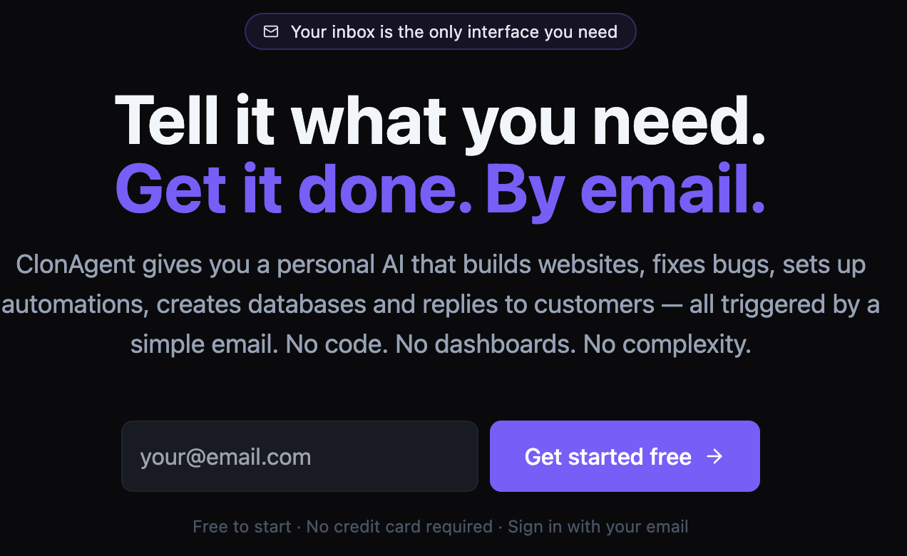

<div align="center">

<a href="https://clonagent.utopiaia.com">
  
</a>

<br /><br />

**[clonagent.utopiaia.com](https://clonagent.utopiaia.com)**

Build AI agents that watch your inbox, act on requests, and reply — automatically.  
No code. No dashboard. Just send an email.

[](https://clonagent.utopiaia.com)

</div>

---

## What is ClonAgent?

ClonAgent lets anyone create an AI agent that monitors an email inbox and acts on what it finds.

You describe your agent in plain language — what project it manages, who can email it, how to deploy. ClonAgent builds it for you. From that moment on, your team manages the agent entirely by email:

```
→  Someone emails a bug report
←  The agent reads it, fixes the code, deploys, and replies with the result
```

**Supported workflows out of the box:**

- Bug reports → auto-fix and deploy
- Feature requests → code and merge
- Content updates → edit, rebuild, publish
- Data queries → run and reply with results
- Anything a developer can do from a terminal

---

## Email commands

Once an agent is running, manage it from any email client. You can either use shorthand commands or just write naturally — the agent understands plain language too.

| Command | What it does |
|---|---|
| `!help` | List all available commands |
| `!status` | Show agent config and last run |
| `!add someone@company.com` | Authorize a new sender |
| `!remove someone@company.com` | Revoke access |
| `!pause` | Stop polling (agent sleeps) |
| `!resume` | Resume polling |
| `!senders` | List all authorized senders |

You can also write requests in plain text and the agent will handle them just the same:

> *"The checkout button on mobile is broken, can you fix it?"*  
> *"Add a dark mode toggle to the settings page."*  
> *"Send me a summary of all open issues."*

---

## Self-hosting

### Requirements

- Node.js 18+
- Python 3.9+ (for the Gmail client)
- An Anthropic API key (or a LiteLLM proxy)

### Quickstart

```bash
git clone https://github.com/KikoCisBot/clonagent.git
cd clonagent
cp .env.example .env          # fill in ANTHROPIC_API_KEY

cd server && npm install && cd ..
cd client && npm install && cd ..

# Two terminals:
( cd server && npm run dev )   # → http://localhost:3300
( cd client && npm run dev )   # → http://localhost:3301
```

Open http://localhost:3301, register, and create your first agent from the chat.

### Environment variables

| Variable | Description |
|---|---|
| `ANTHROPIC_API_KEY` | Required if using Claude directly |
| `LITELLM_URL` + `LITELLM_MASTER_KEY` | Alternative: route via LiteLLM |
| `CLONAGENT_MODEL` | Model to use (default: `claude-opus-4-7`) |
| `PUBLIC_URL` | Your public URL (for magic-link emails) |
| `SMTP_HOST` / `SMTP_PORT` / `SMTP_USER` / `SMTP_PASS` | Transactional email |
| `SENDGRID_API_KEY` | Alternative to SMTP |
| `STRIPE_SECRET_KEY` | Stripe payments |
| `STRIPE_PUBLISHABLE_KEY` | Stripe frontend |
| `STRIPE_WEBHOOK_SECRET` | Stripe webhook verification |
| `AUTH_MODE` | `none` / `basic` / `oidc` (default: `basic`) |

See [.env.example](.env.example) for the full list.

---

## Architecture

```
Browser  ──▶  client (Vite / React)
                │
                ▼
              server (Express, port 3300)
                ├── /api/chat        ──▶  Anthropic / LiteLLM
                ├── /api/agents      ──▶  ~/.claude/skills/<id>/
                ├── /api/auth        ──▶  basic / magic-link / OIDC
                ├── /api/billing     ──▶  Stripe
                └── gmail-poller     ──▶  python3 gmail_client.py
                         │
                         ▼  launchAgent()
                   host-relay  ──▶  Claude CLI session
```

Each agent is a Claude Code skill stored in `~/.claude/skills/<id>/` with its own inbox, authorized senders, and deploy target.

---

## Creating your first agent

1. Open the app → **Chat**
2. Describe your agent in plain English, for example:

   > Create an agent for MIA bug reports. The bot email is `miabot@gmail.com`.  
   > Only `carlos@company.com` can send requests. Repo at `/home/ubuntu/MIA`,  
   > deploy via SSH to `my-server.com`.

3. Drop your `credentials.json` (Gmail OAuth) into the generated skill folder.
4. Run the OAuth flow once: `python3 gmail_client.py auth`
5. Enable the agent from the **Agents** page. Polling starts immediately.

---

## Security

- Passwords are bcrypt-hashed in `data/users.json` (never stored in plain text)
- Magic-link tokens are single-use with a 15-minute expiry
- Secrets (`credentials.json`, `token.json`) are never exposed via the API
- Admin-only routes are protected server-side (settings, user management)
- `.env` and `server/data/` are excluded from git

